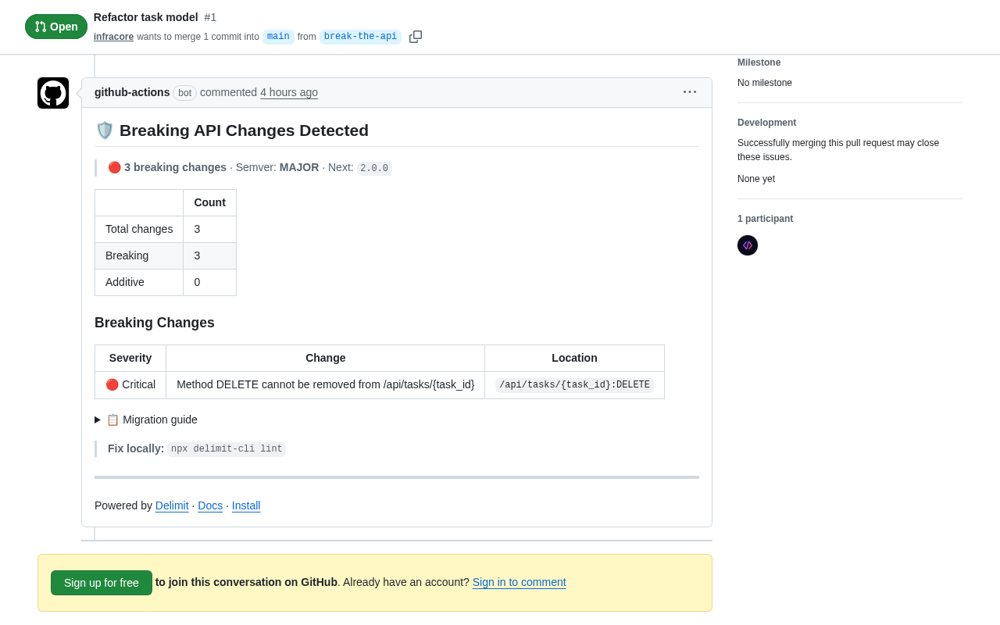

# `</>` Delimit GitHub Action

**Catch breaking API changes before merge** — semver classification, migration guides, and policy enforcement for OpenAPI specs.

[](https://github.com/marketplace/actions/delimit-api-governance)
[](https://opensource.org/licenses/MIT)
[](https://github.com/marketplace/actions/delimit-api-governance)

Delimit runs on every pull request, compares your OpenAPI spec against the base branch, and posts a detailed comment with breaking changes, semver classification, policy violations, and migration guidance. No API keys, no external services, no config required to get started.

## What it looks like

<p align="center">
  
</p>

---

## Features

- **Breaking change detection** — catches 27 types of changes (17 breaking, 10 non-breaking) across endpoints, parameters, response schemas, types, enums, security, and constraints
- **Semver classification** — deterministic `major` / `minor` / `patch` / `none` bump recommendation with computed next version
- **Migration guides** — auto-generated step-by-step migration instructions for every breaking change
- **PR comments** — rich Markdown summary posted directly on your pull request, updated on each push
- **Advisory and enforce modes** — start with non-blocking warnings, promote to CI-gating when ready
- **Custom policies** — define your own governance rules in `.delimit/policies.yml` with path patterns, severity levels, and custom messages
- **7 explainer templates** — developer, team lead, product, migration, changelog, PR comment, and Slack formats

---

## Quick Start

Add this file to `.github/workflows/api-check.yml`:

```yaml
name: API Contract Check
on: pull_request

jobs:
  delimit:
    runs-on: ubuntu-latest
    permissions:
      pull-requests: write
    steps:
      - uses: actions/checkout@v4
      - uses: delimit-ai/delimit-action@v1
        with:
          spec: api/openapi.yaml
```

That is it. Delimit auto-fetches the base branch version of your spec and diffs it against the PR changes. Runs in **advisory mode** by default — posts a PR comment but never fails your build.

### What the PR comment looks like

When Delimit detects breaking changes, it posts a comment like this:

> **Delimit API Governance** | Breaking Changes Detected
>
> | Change | Path | Severity |
> |--------|------|----------|
> | endpoint_removed | `DELETE /pets/{petId}` | error |
> | type_changed | `/pets:GET:200[].id` (string → integer) | warning |
> | enum_value_removed | `/pets:GET:200[].status` | warning |
>
> **Semver**: MAJOR (1.0.0 → 2.0.0)
>
> <details><summary>Migration Guide (3 steps)</summary>
>
> **Step 1**: `DELETE /pets/{petId}` was removed. Update clients to use an alternative endpoint or remove calls to this path.
>
> **Step 2**: `id` changed from `string` to `integer`. Update serialization logic, type assertions, and database column types.
>
> **Step 3**: `status` enum value `"pending"` was removed. Update clients to stop sending this value.
>
> </details>

See the [live demo](https://github.com/delimit-ai/delimit-action-demo/pull/2) — a Users API migration with 23 breaking changes detected across 27 change types, severity badges, and a migration guide.

### Advanced: explicit base and head specs

If you need to compare specific files (e.g., pre-checked-out base branch), use `old_spec` and `new_spec` instead:

```yaml
      - uses: delimit-ai/delimit-action@v1
        with:
          old_spec: base/api/openapi.yaml
          new_spec: api/openapi.yaml
```

---

## Full Usage

```yaml
name: API Governance
on: pull_request

jobs:
  api-check:
    runs-on: ubuntu-latest
    permissions:
      pull-requests: write
    steps:
      - uses: actions/checkout@v4

      - name: Checkout base spec
        uses: actions/checkout@v4
        with:
          ref: ${{ github.event.pull_request.base.sha }}
          path: base

      - uses: delimit-ai/delimit-action@v1
        id: delimit
        with:
          old_spec: base/api/openapi.yaml
          new_spec: api/openapi.yaml
          mode: enforce
          policy_file: .delimit/policies.yml
          github_token: ${{ secrets.GITHUB_TOKEN }}

      - name: Use outputs
        if: always()
        run: |
          echo "Breaking changes: ${{ steps.delimit.outputs.breaking_changes_detected }}"
          echo "Violations: ${{ steps.delimit.outputs.violations_count }}"
          echo "Semver bump: ${{ steps.delimit.outputs.semver_bump }}"
          echo "Next version: ${{ steps.delimit.outputs.next_version }}"
```

---

## Inputs

| Input | Required | Default | Description |
|-------|----------|---------|-------------|
| `spec` | No | `''` | Path to the changed OpenAPI spec. On pull requests, Delimit auto-fetches the base branch version for comparison. |
| `old_spec` | No | `''` | Path to the old/base API specification file. |
| `new_spec` | No | `''` | Path to the new/changed API specification file. |
| `mode` | No | `advisory` | `advisory` (comments only) or `enforce` (fails CI on breaking changes). |
| `github_token` | No | `${{ github.token }}` | GitHub token used to post PR comments. |
| `policy_file` | No | `''` | Path to a custom policy file (e.g., `.delimit/policies.yml`). |

> **Note**: Provide either `spec` for pull request workflows, or both `old_spec` and `new_spec` for explicit comparisons. If neither form is provided, the action exits with an error.

---

## Outputs

| Output | Type | Description |
|--------|------|-------------|
| `breaking_changes_detected` | `string` | `"true"` if any breaking change was found, `"false"` otherwise. |
| `violations_count` | `string` | Number of policy violations (errors + warnings). |
| `semver_bump` | `string` | Recommended version bump: `major`, `minor`, `patch`, or `none`. |
| `next_version` | `string` | Computed next version string (e.g., `2.0.0`). |
| `report` | `string` | Full JSON report of all detected changes, violations, and semver data. |

### Using outputs in subsequent steps

```yaml
- uses: delimit-ai/delimit-action@v1
  id: delimit
  with:
    old_spec: base/api/openapi.yaml
    new_spec: api/openapi.yaml

- name: Block release on breaking changes
  if: steps.delimit.outputs.breaking_changes_detected == 'true'
  run: |
    echo "Breaking changes detected — semver bump: ${{ steps.delimit.outputs.semver_bump }}"
    echo "Next version should be: ${{ steps.delimit.outputs.next_version }}"
    exit 1

- name: Auto-tag on minor bump
  if: steps.delimit.outputs.semver_bump == 'minor'
  run: |
    git tag "v${{ steps.delimit.outputs.next_version }}"
```

---

## Custom Policies

Create `.delimit/policies.yml` in your repository root to define governance rules beyond the defaults.

```yaml
# .delimit/policies.yml

# Set to true to replace all default rules with only your custom rules.
# Default: false (custom rules merge with defaults).
override_defaults: false

rules:
  # Forbid removing endpoints without deprecation
  - id: no_endpoint_removal
    name: Forbid Endpoint Removal
    change_types:
      - endpoint_removed
    severity: error      # error | warning | info
    action: forbid       # forbid | allow | warn
    message: "Endpoint {path} cannot be removed. Use deprecation headers instead."

  # Protect V1 API — no breaking changes allowed
  - id: protect_v1_api
    name: Protect V1 API
    description: V1 endpoints are frozen
    change_types:
      - endpoint_removed
      - method_removed
      - field_removed
    severity: error
    action: forbid
    conditions:
      path_pattern: "^/v1/.*"
    message: "V1 API is frozen. Changes must be made in V2."

  # Warn on type changes in 2xx responses
  - id: warn_response_type_change
    name: Warn Response Type Changes
    change_types:
      - type_changed
    severity: warning
    action: warn
    conditions:
      path_pattern: ".*:2\\d\\d.*"
    message: "Type changed at {path} — verify client compatibility."

  # Allow adding enum values (informational)
  - id: allow_enum_expansion
    name: Allow Enum Expansion
    change_types:
      - enum_value_added
    severity: info
    action: allow
    message: "Enum value added (non-breaking)."
```

### Available change types for rules

| Change type | Breaking | Description |
|-------------|----------|-------------|
| `endpoint_removed` | Yes | An API endpoint path was removed |
| `method_removed` | Yes | An HTTP method was removed from an endpoint |
| `required_param_added` | Yes | A new required parameter was added |
| `param_removed` | Yes | A parameter was removed |
| `response_removed` | Yes | A response status code was removed |
| `required_field_added` | Yes | A new required field was added to a request body |
| `field_removed` | Yes | A field was removed from a response |
| `type_changed` | Yes | A field's type was changed (e.g., string to integer) |
| `format_changed` | Yes | A field's format was changed (e.g., date to date-time) |
| `enum_value_removed` | Yes | An allowed enum value was removed |
| `endpoint_added` | No | A new endpoint was added |
| `method_added` | No | A new HTTP method was added to an endpoint |
| `optional_param_added` | No | A new optional parameter was added |
| `response_added` | No | A new response status code was added |
| `optional_field_added` | No | A new optional field was added |
| `enum_value_added` | No | A new enum value was added |
| `description_changed` | No | A description was modified |

### Default rules

Delimit ships with 6 built-in rules that are always active unless you set `override_defaults: true`:

1. **Forbid Endpoint Removal** — endpoints cannot be removed (error)
2. **Forbid Method Removal** — HTTP methods cannot be removed (error)
3. **Forbid Required Parameter Addition** — new required params break clients (error)
4. **Forbid Response Field Removal** — removing fields from 2xx responses (error)
5. **Warn on Type Changes** — type changes flagged as warnings
6. **Allow Enum Expansion** — adding enum values is always safe (info)

---

## Slack / Discord Notifications

Get notified in Slack or Discord when breaking API changes are detected. Add a `webhook_url` input pointing to your channel's incoming webhook:

```yaml
- uses: delimit-ai/delimit-action@v1
  with:
    spec: api/openapi.yaml
    webhook_url: ${{ secrets.SLACK_WEBHOOK }}
```

The notification fires only when breaking changes are found. If the webhook URL is not set, this step is silently skipped.

### Supported platforms

| Platform | URL pattern | Payload format |
|----------|------------|----------------|
| **Slack** | `hooks.slack.com` | Block Kit with mrkdwn |
| **Discord** | `discord.com/api/webhooks` | Rich embed with color and fields |
| **Generic** | Anything else | Plain JSON event payload |

Delimit auto-detects the platform from the URL and formats the message accordingly. Webhook failures are logged as warnings but never fail your CI run.

### Discord example

```yaml
- uses: delimit-ai/delimit-action@v1
  with:
    spec: api/openapi.yaml
    webhook_url: ${{ secrets.DISCORD_WEBHOOK }}
```

### Generic webhook

Any URL that is not Slack or Discord receives a JSON payload:

```json
{
  "event": "breaking_changes_detected",
  "repo": "org/repo",
  "pr_number": 123,
  "pr_title": "Update user endpoints",
  "breaking_changes": 3,
  "additive_changes": 1,
  "semver": "MAJOR",
  "pr_url": "https://github.com/org/repo/pull/123"
}
```

---

## Advisory vs Enforce Mode

| Behavior | `advisory` (default) | `enforce` |
|----------|---------------------|-----------|
| PR comment | Yes | Yes |
| GitHub annotations | Yes | Yes |
| Fails CI on breaking changes | **No** | **Yes** |
| Exit code on violations | `0` | `1` |

**Start with advisory mode.** It gives your team visibility into API changes without blocking merges. Once your team is comfortable, switch to `enforce` to gate deployments.

```yaml
# Advisory — non-blocking (default)
- uses: delimit-ai/delimit-action@v1
  with:
    old_spec: base/api/openapi.yaml
    new_spec: api/openapi.yaml
    mode: advisory

# Enforce — blocks merge on breaking changes
- uses: delimit-ai/delimit-action@v1
  with:
    old_spec: base/api/openapi.yaml
    new_spec: api/openapi.yaml
    mode: enforce
```

---

## Examples

### Advisory mode (recommended starting point)

```yaml
name: API Check
on: pull_request

jobs:
  api-check:
    runs-on: ubuntu-latest
    permissions:
      pull-requests: write
    steps:
      - uses: actions/checkout@v4
      - uses: actions/checkout@v4
        with:
          ref: ${{ github.event.pull_request.base.sha }}
          path: base
      - uses: delimit-ai/delimit-action@v1
        with:
          old_spec: base/api/openapi.yaml
          new_spec: api/openapi.yaml
```

### Enforce mode

```yaml
name: API Governance
on: pull_request

jobs:
  api-check:
    runs-on: ubuntu-latest
    permissions:
      pull-requests: write
    steps:
      - uses: actions/checkout@v4
      - uses: actions/checkout@v4
        with:
          ref: ${{ github.event.pull_request.base.sha }}
          path: base
      - uses: delimit-ai/delimit-action@v1
        with:
          old_spec: base/api/openapi.yaml
          new_spec: api/openapi.yaml
          mode: enforce
```

### Custom policy file

```yaml
- uses: delimit-ai/delimit-action@v1
  with:
    old_spec: base/api/openapi.yaml
    new_spec: api/openapi.yaml
    mode: enforce
    policy_file: .delimit/policies.yml
```

### Using outputs to control downstream jobs

```yaml
jobs:
  api-check:
    runs-on: ubuntu-latest
    outputs:
      breaking: ${{ steps.delimit.outputs.breaking_changes_detected }}
      bump: ${{ steps.delimit.outputs.semver_bump }}
      next_version: ${{ steps.delimit.outputs.next_version }}
    steps:
      - uses: actions/checkout@v4
      - uses: actions/checkout@v4
        with:
          ref: ${{ github.event.pull_request.base.sha }}
          path: base
      - uses: delimit-ai/delimit-action@v1
        id: delimit
        with:
          old_spec: base/api/openapi.yaml
          new_spec: api/openapi.yaml

  deploy:
    needs: api-check
    if: needs.api-check.outputs.breaking != 'true'
    runs-on: ubuntu-latest
    steps:
      - run: echo "Safe to deploy — next version ${{ needs.api-check.outputs.next_version }}"
```

---

## Supported Formats

- OpenAPI 3.0 and 3.1
- Swagger 2.0
- YAML and JSON spec files

---

## What the PR Comment Looks Like

When Delimit detects changes, it posts (or updates) a comment on your pull request:

```
## Delimit: Breaking Changes `MAJOR`

| Metric | Value |
|--------|-------|
| Semver bump | `major` |
| Next version | `2.0.0` |
| Total changes | 5 |
| Breaking | 2 |
| Violations | 2 |

### Violations

| Severity | Rule | Description | Location |
|----------|------|-------------|----------|
| Error | Forbid Endpoint Removal | Endpoint /users/{id} cannot be removed | `/users/{id}` |
| Warning | Warn on Type Changes | Type changed from string to integer | `/users:200.age` |

<details>
<summary>Migration guide</summary>
...step-by-step instructions for each breaking change...
</details>
```

The comment is automatically updated on each push to the PR branch. No duplicate comments.

---

## FAQ / Troubleshooting

### Delimit skipped validation and did nothing

Both `old_spec` and `new_spec` must be provided. If either is empty, Delimit exits cleanly with no output. Make sure both paths point to valid spec files.

### How do I get the base branch spec?

Use a second `actions/checkout` step to check out the base branch into a subdirectory:

```yaml
- uses: actions/checkout@v4
  with:
    ref: ${{ github.event.pull_request.base.sha }}
    path: base
```

Then reference `base/path/to/openapi.yaml` as `old_spec`.

### My spec file is not found

Verify the path relative to the repository root. Common locations:
- `api/openapi.yaml`
- `docs/openapi.yaml`
- `openapi.yaml`
- `swagger.json`

### The action posts duplicate PR comments

Delimit searches for an existing comment containing "Delimit" from a bot user and updates it in place. If you see duplicates, ensure `github_token` has `pull-requests: write` permission.

### Can I use this with JSON specs?

Yes. Delimit supports both YAML (`.yaml`, `.yml`) and JSON (`.json`) spec files. Set the input paths accordingly.

### Can I use this in a monorepo with multiple specs?

Yes. Add multiple Delimit steps, each with different `old_spec` / `new_spec` pairs:

```yaml
- uses: delimit-ai/delimit-action@v1
  with:
    old_spec: base/services/users/openapi.yaml
    new_spec: services/users/openapi.yaml

- uses: delimit-ai/delimit-action@v1
  with:
    old_spec: base/services/billing/openapi.yaml
    new_spec: services/billing/openapi.yaml
```

### Advisory mode still shows errors in the PR comment — is that expected?

Yes. Advisory mode reports everything (including errors) in the PR comment and GitHub annotations, but it always exits with code `0` so your CI stays green. Switch to `enforce` mode when you want breaking changes to block the merge.

### How is the semver bump calculated?

The classification is deterministic:
- **major** — any breaking change detected (endpoint removed, required param added, field removed, type changed, etc.)
- **minor** — additive changes only (new endpoints, optional fields, enum values added)
- **patch** — non-functional changes only (description updates)
- **none** — no changes detected

---

## CLI

For local development, pre-commit checks, and CI/CD pipelines outside GitHub Actions, use the [Delimit CLI](https://www.npmjs.com/package/delimit-cli):

```bash
npm install -g delimit-cli
delimit lint api/openapi.yaml
delimit diff old-api.yaml new-api.yaml
delimit explain old-api.yaml new-api.yaml --template migration
```

---

## Links

- [Delimit CLI on npm](https://www.npmjs.com/package/delimit-cli) — Local development tool
- [GitHub Repository](https://github.com/delimit-ai/delimit) — Source code and issues
- [GitHub Action Marketplace](https://github.com/marketplace/actions/delimit-api-governance) — Install from Marketplace

---

## License

MIT
